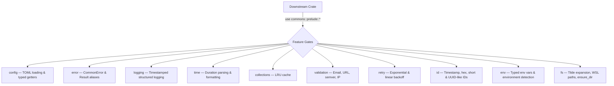

<p align="center">
  
</p>

<h1 align="center">EUXIS Commons</h1>

<p align="center">
  <strong>The foundation crate for the EUXIS ecosystem. Batteries-included utilities for error handling, configuration, validation, retry logic, ID generation, and cross-platform filesystem operations.</strong>
</p>

<p align="center">
  <a href="https://github.com/sebastienrousseau/commons/actions">
    
  </a>
  <a href="https://crates.io/crates/euxis-commons">
    
  </a>
  <a href="https://docs.rs/euxis-commons">
    
  </a>
  <a href="https://codecov.io/gh/sebastienrousseau/commons">
    
  </a>
</p>

<p align="center">
  <em><strong>One crate, ten modules, zero external runtime dependencies</strong> &mdash; Share patterns across every project in the ecosystem without pulling in the kitchen sink.</em>
</p>

---

## Overview

EUXIS Commons is the shared utility layer that powers every crate in the EUXIS ecosystem. Rather than scattering helper functions across repositories or pulling in heavyweight frameworks, Commons provides a curated, feature-gated set of modules that compile only what you use.

## Why Commons?

| Concern | Without Commons | With Commons |
| :--- | :--- | :--- |
| **Error Types** | Each crate invents its own | **Unified `CommonError` + `CommonResult`** |
| **Config Loading** | Raw `toml::from_str` everywhere | **`Config::from_file` with typed getters** |
| **Retry Logic** | Copy-pasted sleep loops | **Configurable backoff strategies** |
| **ID Generation** | `uuid` + `rand` dependency bloat | **Zero-dep timestamp, hex, and short IDs** |
| **Path Handling** | Manual `~` expansion, WSL hacks | **`resolve_path`, `to_wsl_path`, `from_wsl_path`** |
| **Validation** | Ad-hoc regex checks | **`is_valid_email`, `is_valid_url`, `is_valid_semver`** |

## Architecture



## Getting Started

### Pre-flight Checklist

- [ ] Rust 1.88.0+ installed (`rustc --version`)
- [ ] Cargo package manager ready

### Install

Add `euxis-commons` to your project:

```bash
cargo add euxis-commons
```

Or with specific features only:

```toml
[dependencies]
euxis-commons = { version = "0.0.2", default-features = false, features = ["error", "time"] }
```

## Features

All features are enabled by default via the `full` meta-feature. Disable `default-features` and pick only what you need to minimise compile times.

| Feature | Description | Dependencies |
| :--- | :--- | :--- |
| `config` | TOML configuration loading with typed getters and `Vec<T>` array extraction | `serde`, `toml` |
| `error` | Common error types and `Result` aliases | `thiserror` |
| `logging` | Simple timestamped, level-filtered structured logging | `time` |
| `time` | Duration parsing (including compound `"1h 30m"`) and formatting | &mdash; |
| `collections` | LRU cache with capacity-bounded eviction | &mdash; |
| `validation` | Email, URL (with localhost + port), semver (with pre-release), IP, identifier checks | &mdash; |
| `retry` | Retry with constant, linear, and exponential backoff + jitter | &mdash; |
| `id` | Timestamp-sortable, random hex, short base62, and UUID-like ID generation | &mdash; |
| `env` | Typed env var access, boolean parsing, list splitting, environment detection | &mdash; |
| `fs` | Tilde expansion, `ensure_dir`, WSL detection, bidirectional WSL path translation | &mdash; |

## Usage

<details>
<summary><b>Error Handling</b></summary>

```rust
use commons::error::{CommonError, CommonResult};

fn process_data(input: &str) -> CommonResult<String> {
    if input.is_empty() {
        return Err(CommonError::invalid_input("Input cannot be empty"));
    }
    Ok(input.to_uppercase())
}
```
</details>

<details>
<summary><b>Configuration</b></summary>

```rust
use commons::config::Config;
use serde::Deserialize;

#[derive(Debug, Deserialize)]
struct AppConfig {
    name: String,
    port: u16,
}

let config: AppConfig = Config::from_file("config.toml")?.parse()?;
```

Arrays are supported out of the box:

```rust
let hosts: Option<Vec<String>> = config.get("allowed_hosts");
```
</details>

<details>
<summary><b>Time & Duration Parsing</b></summary>

```rust
use commons::time::{format_duration, parse_duration};
use std::time::Duration;

// Single unit
let d = parse_duration("5m").unwrap();
assert_eq!(d, Duration::from_secs(300));

// Compound expression
let d = parse_duration("1h 30m").unwrap();
assert_eq!(d, Duration::from_secs(5400));

let formatted = format_duration(Duration::from_secs(3665));
assert_eq!(formatted, "1h 1m");
```
</details>

<details>
<summary><b>Retry with Backoff</b></summary>

```rust
use commons::retry::{retry, RetryConfig, BackoffStrategy};
use std::time::Duration;

let config = RetryConfig::new()
    .max_attempts(5)
    .backoff(BackoffStrategy::Exponential {
        initial: Duration::from_millis(100),
        max: Duration::from_secs(10),
        multiplier: 2.0,
    });

let result = retry(config, || {
    // Operation that might fail
    Ok::<_, &str>("success")
});
```
</details>

<details>
<summary><b>ID Generation</b></summary>

```rust
use commons::id::{generate_id, generate_prefixed_id, IdFormat};

let ts_id   = generate_id(IdFormat::Timestamp);  // 20-char sortable
let hex_id  = generate_id(IdFormat::RandomHex);   // 32-char hex
let short   = generate_id(IdFormat::Short);        // 12-char base62
let user_id = generate_prefixed_id("usr");         // "usr_A1b2C3d4E5f6"
```
</details>

<details>
<summary><b>Validation</b></summary>

```rust
use commons::validation::*;

assert!(is_valid_email("user@example.com"));
assert!(is_valid_url("http://localhost:8080/api"));
assert!(is_valid_semver("1.0.0-alpha.1"));
assert!(is_valid_ip("::1"));
assert!(is_identifier("snake_case_name"));
```
</details>

<details>
<summary><b>Cross-Platform Filesystem</b></summary>

```rust
use commons::fs::{resolve_path, to_wsl_path, from_wsl_path, ensure_dir, is_wsl};

// Tilde expansion
let path = resolve_path("~/.config/app.toml");

// WSL path translation (bidirectional)
let wsl  = to_wsl_path(r"C:\Users\Name\file.txt");   // /mnt/c/Users/Name/file.txt
let win  = from_wsl_path("/mnt/c/Users/Name/file.txt"); // C:\Users\Name\file.txt

// Create nested directories
ensure_dir("~/.config/myapp/logs").unwrap();
```
</details>

<details>
<summary><b>Prelude (Import Everything)</b></summary>

```rust
use commons::prelude::*;

// All public types from enabled features are now in scope
let mut cache = LruCache::new(100);
cache.insert("key", "value");
```
</details>

## Reusable CI Workflows

Commons ships reusable GitHub Actions workflows that downstream crates can call directly:

```yaml
# .github/workflows/ci.yml in your downstream crate
jobs:
  ci:
    uses: sebastienrousseau/commons/.github/workflows/ci.yml@main

  coverage:
    uses: sebastienrousseau/commons/.github/workflows/coverage.yml@main
    secrets: inherit

  audit:
    uses: sebastienrousseau/commons/.github/workflows/audit.yml@main
```

## Safety & Compliance

- **`#![deny(unsafe_code)]`** &mdash; No unsafe blocks anywhere in the crate
- **MIRI-verified** &mdash; CI runs `cargo miri test` on every push
- **Pedantic linting** &mdash; Survives `clippy::pedantic`, `clippy::nursery`, and `clippy::cargo`
- **95%+ code coverage** &mdash; Cross-platform matrix (Linux, macOS, Windows)

## Minimum Supported Rust Version

This crate requires **Rust 1.88.0** or later (`edition = "2024"`).

---

<p align="center">
  THE ARCHITECT &#x16EB; <a href="https://sebastien.sh">Sebastien Rousseau</a><br/>
  THE ENGINE &#x16DE; <a href="https://euxis.com">EUXIS</a> &#x16EB; Enterprise Unified Execution Intelligence System
</p>

## License

Licensed under the MIT License or Apache-2.0, at your option. See [LICENSE-MIT](LICENSE-MIT) or [LICENSE-APACHE](LICENSE-APACHE) for details.

<p align="right"><a href="#euxis-commons">&#8593; Back to Top</a></p>
